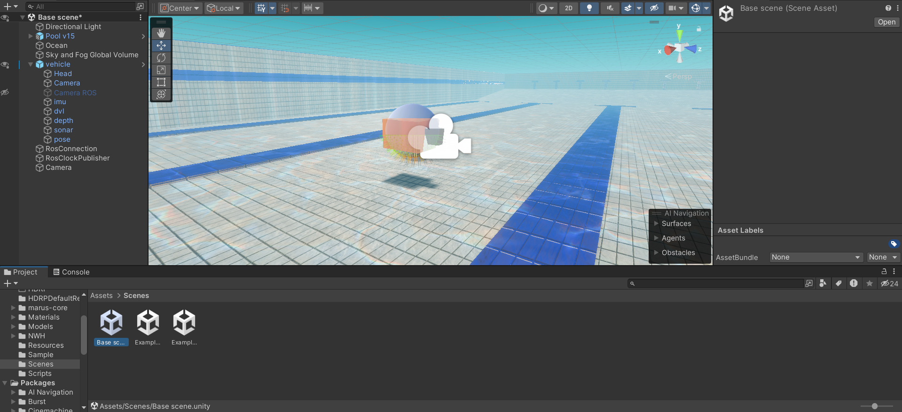

## Install the Unity Editor

After installing Unity Hub, you can install the Unity Editor. The project is validated with Unity 2022.3.8f1. Other versions should work, but are not guaranteed to be compatible.

## Cloning the Project

```git clone https://github.com/NTU-Mecatron/UnitySim.git```

> Note: Avoid downloading as zip as it might lead to errors.

## Opening the Project

In the Unity Hub, click on the `Add` button and navigate to the project folder. Select the folder and click on the `Open` button. The project should now appear in the Unity Hub.

After opening the project, navigate to the `Assets/Scenes` folder and open the `Base scene`. A full explanation of the `Base scene` can be found in the [explanation](explanation.md) section.



## Configuring the external Script Editor

You can either use Microsoft Visual Studio or Visual Studio Code as the script editor. Common steps for setting up:  

1. Window -> Package Manager. In the top left corner, select `Unity Registry` from the Packages drop-down menu. Install both the `Visual Studio Code Editor` and `Visual Studio Editor` packages.

2. Edit -> Preferences -> External Tools. Set the External Script Editor to the desired editor.

## Configuring ROS settings in Unity
Refer to [ROS-Components](explanation.md#ros-components) for setting up the ROS connection in Unity.    

## Setup ROS workspace

First, we need to install the `ROS-TCP-Endpoint` package. This package is used to communicate between Unity and ROS. 

```bash
cd ~/catkin_ws/src

# clone the Roscpp branch which is supposedly the more performant version for camera streaming
git clone -b Roscpp https://github.com/Unity-Technologies/ROS-TCP-Endpoint.git

cd ..

catkin_make
```

Afterwards, you need to make a small modification to the launch file as explained in the [The-ROS-Workspace](explanation.md#the-ros-workspace) section.

## Running the project
- Run the launch file in the terminal. This must be done before playing the Unity scene. Make sure that you have set the param `/use_sim_time` to `true` in the launch file.

```bash
roslaunch ros_tcp_endpoint endpoint.launch
```

- Play the Unity scene. The scene should now be connected to ROS.

- Press `C` to enable keyboard control of the vehicle. Use `WASD` to move in 2D plane, and `Q` and `E` to move up and down, and `J` and `K` to rotate the vehicle.


