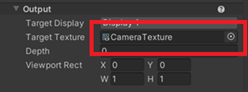
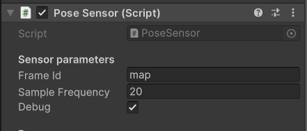
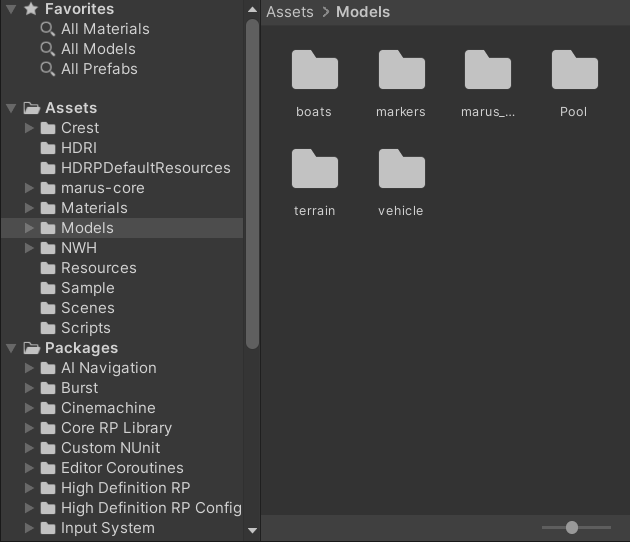

# Breaking down this example...
This page contains brief explanations and justifications for the various components in the Unity and ROS 2 workspaces that we wrote for this example.

**Table of Contents**
- [The Unity Project](#the-unity-project)
    - [Scripts](#scripts)
        - [VehicleControllerUnity](#vehiclecontrollerunity)
        - [Clock](#clock)
        - [ROSClockPublisher](#rosclockpublisher)
        - [TfStreamer_modified](#tfstreamer_modified)
        - [CameraROS_modified](#cameraros_modified)
        - [ImuROS_modified](#imuros_modified)
        - [DvlROS_modified](#dvlros_modified)
        - [DepthROS_modified](#depthros_modified)
        - [Sonar2DROS_modified](#sonar2dros_modified)
        - [PoseROS_modified](#poseros_modified)
    - [Prefabs](#prefabs)
        - [Marker](#marker)
        - [TurtleBot3ManualConfig](#turtlebot3manualconfig)
    - [Scenes](#scenes)
        - [SimpleWarehouseScene](#simplewarehousescene)
        - [BasicScene](#basicscene)
- [The ROS 2 Workspace](#the-ros-2-workspace)
    - [Launch file (unity_slam_example.py)](#launch-file-unity_slam_examplepy)
    - [RViz config (nav2_unity.rviz)](#rviz-config-nav2_unityrviz)
    - [Other project files](#other-project-files)

---
## The Unity Project

Everything we've created to enable this particular Project lives inside the Assets folder, which you can locate in the Project Browser panel.

### Scripts

This project has been built on the original MARUSimulator project, which has made it possible to add a variety of sensors such as IMU, DVL, depth and multibeam sonar. Marus has its own ROS integration but it is not well supported and documented. As such, we've added a few "modified" scripts to make the integration possible. Some other scripts such as [Clock](#clock) and [ROSClockPublisher](#rosclockpublisher) are borrowed from the Unity Nav2-SLAM-Example project; the format of the documentation is also borrowed from there.

> Link to the original projects: [MARUSimulator](https://github.com/MARUSimulator/marus-example) and [Unity Nav2-SLAM-Example](https://github.com/Unity-Technologies/Robotics-Nav2-SLAM-Example/tree/main)

In the future, many parts of the project will be updated to use even more accurate physics simulation with Articulation bodies. Right now, all of the GameObjects use RigidBody.

#### VehicleControllerUnity  
This script is responsible for controlling the vehicle. Attach this script to the GameObject that you want to control. It uses the Unity Input System to get the input from the user. Press C to start the control, and then WASD for 2D movements, QE for updown and JK for rotation.

#### Clock
In order to keep ROS nodes and our time-dependent code in Unity synced, we define a `Clock` class that serves as an abstraction layer to ensure we use the same interface to access either Unity time or a ROS 2 time source. For the purposes of this example, we assume `use_sim_time` is true, and that Unity is providing the definitive clock.

#### ROSClockPublisher
As the name implies, this publishes the output of our Clock class to the ROS `/clock` topic at fixed intervals. This allows other ROS nodes to subscribe and stay in sync with the currently simulated time.

#### TfStreamer_modified
This script is responsible for publishing the transform data to the ROS `/tf` topic. It will publish the transform data of the GameObject that it is attached to. `FrameId` and `ChildFrameId` are often set automatically based on the name of the GameObject. The `PublishFrequency` field is usually 10.

> Note: This component must be attached to GameObjects containing `Sonar2DROS_modified` in order to visualize them in Rviz, and is already done automatically when you add the sonar component.

#### CameraROS_modified
 

This script is responsible for publishing the camera image to the ROS `/sensor/camera` topic. The published data is of type `sensor_msgs/Image`. In order to stream properly, you must assign the `CameraTexture` (which is a RenderTexture) to the `Camera/Output/TargetTexture` field in the script.

Note: When a RenderTexture is assigned to `TargetTexture` field, you will not be able to see the camera image in the Game view anymore. That's why there are two cameras attached to the vehicle, one to let the person in Unity see, and the other to stream to ROS. However, if you are already watching from Rviz, you don't need this camera.

#### ImuROS_modified
This script is responsible for publishing IMU data of type `sensor_msgs/Imu` to the `/sensor/imu` topic. The published data is already translated to the ROS Body frame Forward-Left-Up (FLU).  

It will also attach the `ImuSensor` component to the GameObject which samples the IMU data.  

 
<!--  -->
Note: To prevent the console from logging "No noise instance" error, you must select either "AlfaBeta" or "Gaussian" as the noise type for all Acceleration, Angular Velocity, and Orientation Noise.

Note: Due to a small bug with Marus Noise, after you have changed the values for `bias` and `std` and click Play, if you open the Noise component again, you will see that the values have been reset to 0. However, if you don't open to check, the noise values will be correctly applied. Thus, either you should not open to check, or you re-type the values when you open it.

#### DvlROS_modified
Similar to IMU, this script publishes linear velocity data to the ROS `/sensor/dvl` topic in the FLU frame of type `geometry_msgs/TwistStamped`. You must also select a noise model.

#### DepthROS_modified
This script publishes the depth data to the ROS `/sensor/depth` topic of type `std_msgs/Float32`.

#### Sonar2DROS_modified

<!--  -->

This script publishes the point cloud data generated by a forward-looking multibeam sonar to `/sensor/multibeam_sonar` topic of type `sensor_msgs/PointCloud2`. You can also modify the noise parameters to make the point cloud more random.  

Tick the checkbox `Add Noise For Vertical Axis` to make the point cloud 3D.

For the `Sonar2D` component, you can set the `Resolution` (number of beams and thus points generated), `MaxDistance` and `MinDistance` of the beams. Make sure to assign 'PointMaterial' to `Particle Material` and 'PointCloudCS' to `PointCloudShader`.

Note: You must add `TfStreamer_modified` script to the GameObject that has the `Sonar2D` component in order to visualize the point cloud in RViz.

#### PoseROS_modified

This script publishes the true pose data to the ROS `/vehicle/true_pose` topic of type `geometry_msgs/PoseStamped`. You must set `FrameId` as `map`in order to visualize it correctly in RViz. The published data has been translated to the ROS World frame East-North-Up (ENU).  

### Prefabs
All of the prefabs are located in the Assets/Models folder. You can drag and drop them into the scene.
<!--  -->

